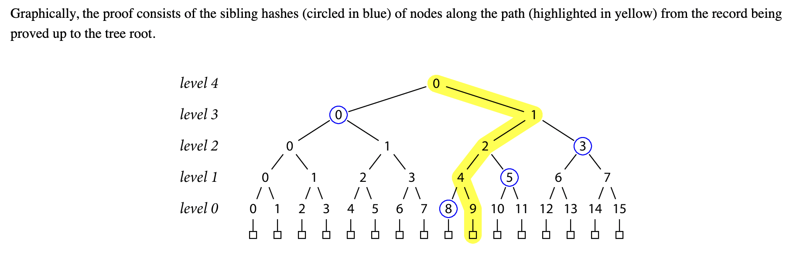

# Attack Vectors

## Second Pre-Image Attack

Can we prove that an intermediary-hash is part of the tree?

Yes!

If the proof for element `9` consists of `[8, 5, 3, 0]` (the blue-circled nodes), we can also proof that the blue-circled `3` itself is part of the **tree** via `[2, 0]`.

_(Note that a merkle proof should not only proof that an element is part of the tree, but that the element is a **leaf** of the tree)_

A _second pre-image attack_ is where you are given some data and your task is to find a second set of data which generates the same hash as the first.
_(See [Attacking Merkle Trees With a Second Preimage Attack ](https://flawed.net.nz/2018/02/21/attacking-merkle-trees-with-a-second-preimage-attack/))_

The merkle root has a lof of different second pre-images!

_(Note that this is an inherent problem of merkle trees)_

However, it is easy to fix in real life by differentiating between leaf nodes
and intermediary nodes.

In case of on-chain verification, see [attacking OpenZeppelin](./verification-oz/test/MerkleVerification.t.sol) and [attacking solmate](./verification-solmate/test/MerkleVerification.t.sol).

[Prev](./4_OnChainVerification.md)
[Start](./README.md)
